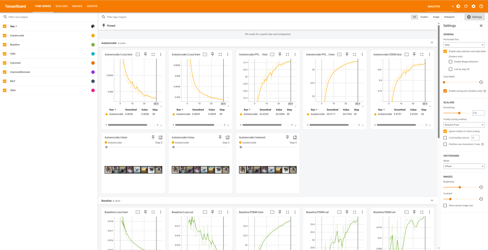

# DeepLearning — 컴퓨터 비전 4대 태스크 실습

PyTorch로 **이미지 분류 · 분할 · 디노이징 · 컬러화** 네 가지 태스크를 구현하고, 각 태스크마다 베이스라인 모델과 개선 모델을 비교한 프로젝트입니다. 모든 학습 과정은 TensorBoard로 기록했습니다.



## 결과 요약

| Task | 데이터셋 | 베이스라인 | 개선 모델 | 핵심 지표 |
|---|---|---|---|---|
| 1. 분류 | CIFAR-10 | MLP | CNN | Test Acc **50.94% → 81.49%** |
| 2. 분할 | Oxford-IIIT Pet | — | U-Net | Val mIoU **0.7387** |
| 3. 디노이징 | CIFAR-10 (σ=0.2) | Autoencoder | ImprovedDenoiser (U-Net형 skip) | Test PSNR **24.44 → 25.10 dB**, SSIM 0.817 → 0.840 |
| 4. 컬러화 | Flickr8k | BaselineColorizer | ImprovedColorizer (Skip + Residual + Attention Gate) | Val PSNR **23.53 → 23.62 dB**, SSIM 0.9205 → 0.9232 |

지표별 상세 수치와 TensorBoard 스크린샷은 [`results/README.md`](results/README.md)에 정리되어 있습니다.

## 태스크별 구성

### Task 1 — Image Classification (`task1_ImageClassification.py`)
- CIFAR-10 10클래스 분류
- **MLP**: 이미지를 펼쳐 fully-connected 층으로 분류
- **CNN**: Conv → BatchNorm → ReLU → MaxPool → Dropout 블록을 쌓은 구조
- CrossEntropyLoss, SGD(lr=0.01, momentum=0.9), 20 epochs

### Task 2 — Image Segmentation (`task2_ImageSegmentation.py`)
- Oxford-IIIT Pet 데이터셋, 픽셀 단위 3클래스 분할 (배경 / 동물 / 경계)
- **U-Net**: 인코더-디코더 + skip connection
- CrossEntropyLoss, AdamW(lr=1e-3) + CosineAnnealingLR, 30 epochs
- 평가 지표: mIoU

### Task 3 — Image Denoising (`task3_ImageDenoising.py`)
- CIFAR-10 이미지에 가우시안 노이즈(σ=0.2)를 넣고 원본을 복원
- **Autoencoder**: 기본 인코더-디코더
- **ImprovedDenoiser**: 인코더 특징을 디코더에 이어붙이는 U-Net형 skip connection
- MSELoss, AdamW(lr=1e-3) + CosineAnnealingLR, 30 epochs
- 평가 지표: PSNR, SSIM

### Task 4 — Image Colorization (`task4_ImageColorization.py`)
- Flickr8k 이미지를 **Lab 색공간**으로 변환해, 밝기 채널 L(1ch)을 입력받아 색 채널 ab(2ch)를 예측
- 데이터 증강: 좌우 반전, resize 후 랜덤 크롭, L 채널 밝기 지터
- **BaselineColorizer**: Conv 인코더 + ConvTranspose 디코더, 출력은 Tanh로 [-1, 1]
- **ImprovedColorizer**: skip connection + residual bottleneck + **Attention Gate**(skip으로 넘어가는 특징 중 중요한 영역만 강조)
- MSELoss, AdamW(lr=1e-3), 30 epochs
- 평가 지표: PSNR, SSIM (Lab → RGB 변환 후 계산)

## 실행 방법

### 1. 환경 설정
```bash
python -m venv .venv
.venv\Scripts\activate          # Windows
pip install torch torchvision tensorboard numpy matplotlib scikit-image pillow thop
```

### 2. 데이터셋 준비
용량이 커서 `data/` 폴더는 저장소에 포함하지 않았습니다 (`.gitignore`).

| 데이터셋 | 준비 방법 |
|---|---|
| CIFAR-10 | Task 1·3 실행 시 `./data`에 자동 다운로드 |
| Oxford-IIIT Pet | Task 2 실행 시 `./data`에 자동 다운로드 |
| Flickr8k | Kaggle에서 직접 받아 `data/flicker8k/Images/archive/Images/`에 jpg 파일 배치 |

### 3. 학습 실행
```bash
python task1_ImageClassification.py
python task2_ImageSegmentation.py
python task3_ImageDenoising.py
python task4_ImageColorization.py
```

### 4. TensorBoard로 결과 확인
```bash
tensorboard --logdir runs
```
브라우저에서 `http://localhost:6006` 접속

## 폴더 구조
```
DeepLearning/
├── task1_ImageClassification.py
├── task2_ImageSegmentation.py
├── task3_ImageDenoising.py
├── task4_ImageColorization.py
├── results/
│   ├── README.md          # 상세 결과 정리
│   └── screenshots/       # TensorBoard 캡처
├── data/                  # 데이터셋 (git 제외)
└── runs/                  # TensorBoard 로그 (git 제외)
```

## 참고 사항
- Windows에서는 `DataLoader(num_workers>0)` 사용 시 multiprocessing 오류가 나서 `num_workers=0`으로 설정했습니다.
- Task 2는 처음에 고정 로그 경로(`runs/UNet`)를 써서 재실행할 때마다 로그가 겹쳤습니다. 지금은 `runs/UNet_{timestamp}`로 실행마다 새 폴더를 쓰도록 수정했습니다.
